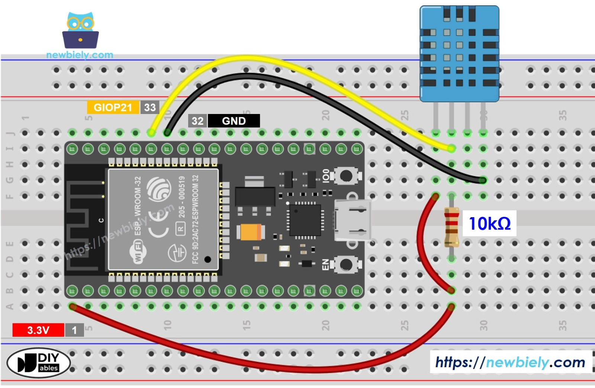

## Ir Além: Sistema de Coleta e Comunicação de Dados Usando ESP32 Integrado ao Wi-Fi

#### Justificativa do sensor escolhido

Foi utilizado um sensor chamado *DHT11* para a captura de dados de temperatura e humidade. Foi escolhido este tipo de sensor pois se trata de um dos sensores mais comuns no contexto de cultivo de diversas culturas de plantio, assim como, o monitoramento da temperatura e humidade faz parte dos cuidados mais importantes presentes no processo de plantio de alimentos, onde para cada tipo de cultura há um valor específico que deve ser mantido para a saúde da plantação.

Foi utilizado também um Broker MQTT (especificamente, **RabbitMQ**) para realizar o envio das informações de temperatura e humidade. Do outro lado, uma API em Python (Fast API) consome essas mensagens logo na inicialização da aplicação. Esta API é configurada com um endpoint de WebSocket, que permite um *frontend*, por exemplo, (no caso, uma página html) consumir essas informações em **tempo real**.

#### Diagrama da arquitetura do circuito

**Tecnologias utilizadas:**

- Esp32;
- Jumpers (para fazer a ligação nos terminais);
- Resistor de 10k Ohm;
- Sensor DHT11;

Vídeo explicativo do funcionamento do entregável: [Ir Além com ESP 32](https://youtube.com/shorts/vXjqEWkM38E?feature=share)